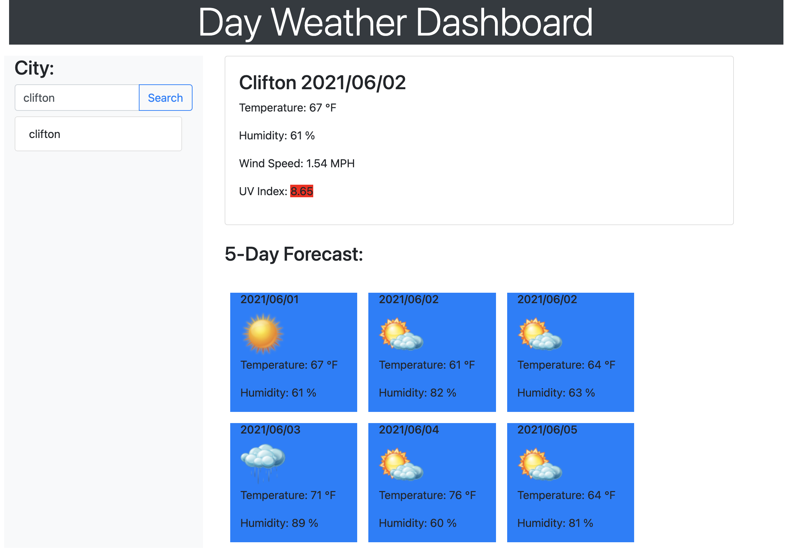

# JS-Weathe-Dashboard

## Table of Contents

* [Description](#Description)
* [Challenges](#Challenges)
* [Tools](#Tools)

## Description 

This Assignment was really challenging I had to learn how to use JavaScript to assign functions, Eventlisteners, and localstorage. but rendering API calls was easy since i had Experience with the projects.

https://juan8389.github.io/JS-Weathe-Dashboard/
 

## Challenges

Local Storage is a difficult concept to grab but i was able to work with it 

## Tools 

I used tutoring, https://openweathermap.org/, getbootstrap and W3schools most important my notes and class work.
